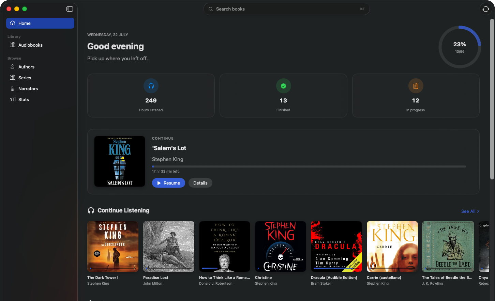
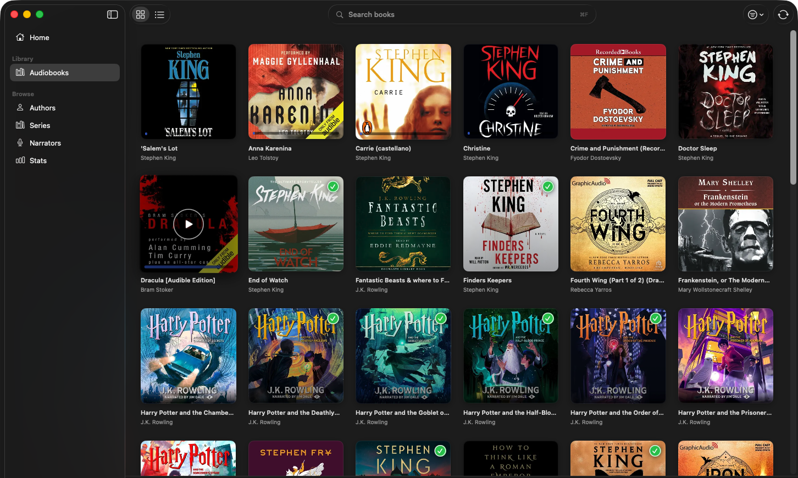

<div align="center">
  
  <h1>Alexandria</h1>
  <p><strong>A beautiful, native macOS client for your <a href="https://www.audiobookshelf.org/">audiobookshelf</a> library.</strong></p>
  <p>
    
    
    
  </p>
</div>

<br/>

<div align="center">
  
</div>

## Why Alexandria?

Every audiobookshelf client is iOS-first — Alexandria is built for the Mac. A real
SwiftUI app with a personal Home, gapless multi-track playback, offline downloads, and
deep system integration, designed to feel like it shipped with macOS.

## Features

- **Personal Home** — a time-of-day greeting, a library-completion ring, listening
  stats, a one-tap **Continue**, and shelves for *Continue Listening*, *Discover*,
  *Listen Again*, and *Recently Added*.
- **Gapless playback** — full multi-track books via `AVQueuePlayer` with chapters,
  ±15/30s skip, 0.75–3× speed, and a scrubber.
- **Controls everywhere** — media keys & Now Playing (with artwork), a **menu-bar
  mini-player**, and spacebar play/pause.
- **Offline** — download books for offline listening; progress queues locally and
  syncs when you reconnect.
- **Progress sync** — reads/writes `/api/me/progress`, resumes where you left off,
  and shows finished badges on covers.
- **Fast search** — a modern results dropdown with keyboard navigation and quick-play,
  focusable from anywhere with **⌘F**.
- **Browse & stats** — Authors, Series, Narrators, a full library grid/table with
  sort & filter, and a Stats dashboard.
- **Multi-server** — add, switch, and remove servers from the sidebar.
- **Thoughtful details** — sleep timer, colorful placeholder art, native onboarding,
  and Reduce-Motion-aware animation throughout.

## Screenshots

| Home | Library |
| :--: | :--: |
|  |  |

## Install

### Download (easiest)

1. Grab the latest **`Alexandria-x.y.z.dmg`** from **[Releases »](https://github.com/ahamedzoha/alexandria/releases/latest)**.
2. Open the DMG and drag **Alexandria** into **Applications**.
3. First launch (the build is free and **unsigned**, so Gatekeeper warns once):
   **right-click the app → Open → Open**. Or, in Terminal:
   ```bash
   xattr -dr com.apple.quarantine /Applications/Alexandria.app
   ```
4. Enter your server URL, username, and password.

Requires **macOS 26 (Tahoe) or later**.

### Build from source

- **Xcode 26 or later** — the UI adopts macOS 26 *Liquid Glass* APIs
  unconditionally, so both building and running require macOS 26.
- Open `Alexandria.xcodeproj`, pick scheme **Alexandria** / destination **My Mac**,
  press **⌘R**.

New `.swift` files dropped into `Alexandria/` are picked up automatically (Xcode
synchronized folders — no project fiddling).

## Releasing

Bump the version (target → General → Version), then tag it:

```bash
git tag v0.2.0 && git push origin v0.2.0
```

A GitHub Action builds the DMG and publishes the release with generated notes. The full
flow — versioning, the unsigned-install caveat, and the later Developer ID +
notarization path — lives in **[DISTRIBUTING.md](DISTRIBUTING.md)**.

## Tech

SwiftUI · Observation · AVFoundation (`AVQueuePlayer`, chapters) · MediaPlayer
(Now Playing / remote commands) · `async`/`await` REST against the audiobookshelf API.
macOS 26 deployment target; Liquid Glass adopted throughout.

## Roadmap

- [ ] Custom app icon polish · podcast support · Handoff
- [ ] Per-track download progress
- [ ] Keychain token storage (needs a signing team)
- [ ] Signed & notarized releases

## Press kit

Logo and screenshots for write-ups live in **[`press-kit/`](press-kit/)**.

---

<sub>Not affiliated with the audiobookshelf project. Built by
<a href="https://github.com/ahamedzoha">@ahamedzoha</a>.</sub>
